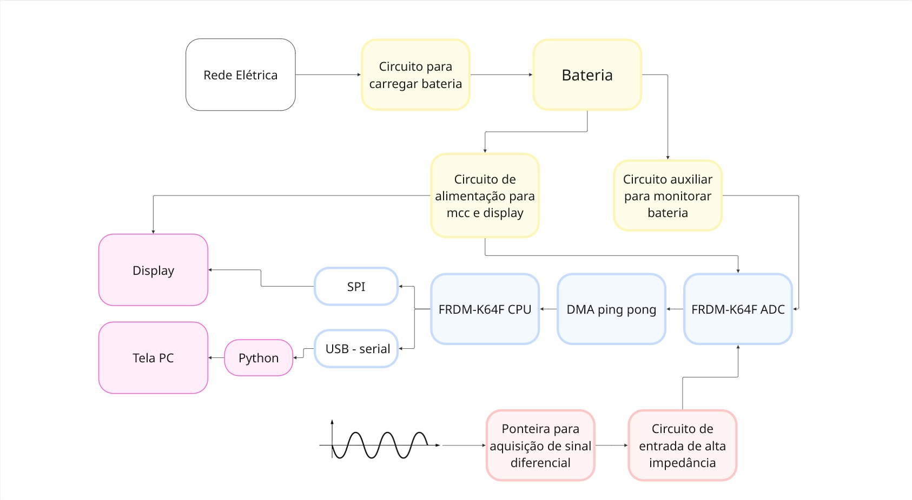

# Osciloscópio Portátil

Este projeto faz parte da disciplina **Projeto Integrador III** do curso de Engenharia Eletrônica.  
O objetivo é desenvolver um **osciloscópio portátil** com interface touch, comunicação com PC e sistema de bateria integrado.

## 👥 Membros do grupo
- Elisa  
- Fabricio  
- Matheus  

## 🎯 Objetivos do projeto
- Desenvolver um osciloscópio portátil funcional e de baixo custo.  
- Implementar interface de visualização em **touch screen**.  
- Garantir portabilidade através de bateria recarregável via USB.  
- Estabelecer comunicação com PC para análise de dados.  
- Projetar um **case robusto e ergonômico**.  

## 📦 Entregas da Etapa 1
- Relatório de requisitos atualizado (hardware, software, comunicação, case).  
- Pesquisa sobre componentes (microcontrolador, bateria, carregamento, touchscreen, protocolos de comunicação).  
- Justificativa de escolhas de componentes com orçamentos preliminares.  
- Cálculos iniciais de consumo energético.  
- Diagrama de blocos revisado.  
- Cronograma do projeto.  

## 📅 Cronograma
- Apresentação Etapa 1: **25/09**  
- Apresentação Etapa 2: **16/10**  
- Apresentação Etapa 3: **13/11**  
- Apresentação Etapa 4: **18/12**  

## 🛠️ Componentes
- Microcontrolador principal FRDM-K64F  
- Comunicação SPI e Serial  
- Touchscreen  
- Circuito de carregamento USB + bateria recarregável  

---
📌 A documentação detalhada pode ser encontrada na pasta [`docs/`](docs/).

## 📅 Etapa 2 – Testes de Hardware e Integração Inicial
**Apresentação:** 16/10  
### Subentregas:
- Testar periféricos do microcontrolador  
- Testar touch screen (pode ser com Arduino)  
- Testar circuito de carregamento de bateria com a bateria  
- Desenvolver design inicial do case  

### Entregas Git:
- Esquemático preliminar elétrico e layout do PCB  
- Arquivos preliminares de design do case  
- Código fonte do firmware dos testes  
- Relatório de testes de hardware  
- Manual de montagem

  ---
📌 A documentação detalhada pode ser encontrada na pasta  [`docs/etapa2`](docs/etapa2).

## 📅 Etapa 3 – Integração Total, protótipo inicial
**Apresentação:** 27/11  
### Subentregas:
- Desenvolver o app de comunicação com osciloscopio.
- Integrar o app com o firmware e hardware
- Definir métodos de amostragem e filtros
- Revisar design do case e identificar melhorias
- Monitorar bateria através do microcontrolador
- Fabricar protótipo do case

### Entregas Git:
- Código fonte do app
- Diagrama de arquitetura de software
- Relatório de integração
- Guia de instalação do app  
---
Documentos dessa etapa estão na pasta [`docs/etapa2`](docs/etapa3).
