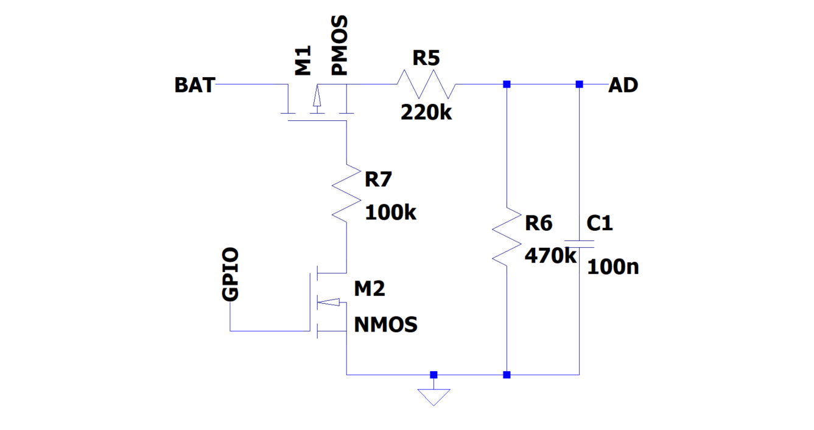

# Relatório de Requisitos – Osciloscópio Portátil

## Funcionalidades – Categorizadas
### Hardware
- Microcontrolador principal com ADC de alta taxa de amostragem.
- Bateria recarregável com carregamento via USB.
- Tela touch para visualização de sinais.
- Circuito de condicionamento de sinal.
- Porta de comunicação (USB/serial).

### Software
- Firmware para aquisição e processamento de sinais.
- Visualização de formas de onda na tela.
- Comunicação com aplicativo no PC.
- Funções básicas: ajuste de escala, trigger, tempo/div.

### Comunicação
- Definição de protocolo de comunicação.
- Troca de dados entre osciloscópio e PC.
- Medição e monitoramento de bateria via firmware.

## Troca de Dados entre microcontrolador e PC
A placa FRDM-K64F conta com interface USB OTG integrada, que pode ser configurada para atuar como dispositivo de comunicação serial (CDC), permitindo que, ao ser conectada ao computador via cabo micro-USB, seja reconhecida automaticamente como uma porta COM virtual. Essa funcionalidade possibilita a transmissão de amostras em tempo real, utilizando os drivers e bibliotecas já disponíveis no SDK da NXP (MCUXpresso), com taxa de até 1 Msample/s. No computador, a comunicação pode ser facilmente estabelecida em linguagem Python, por meio das bibliotecas pyserial para recepção dos dados e matplotlib para a visualização gráfica, viabilizando o monitoramento e análise imediata dos sinais adquiridos.

## Monitoramento da Bateria via pino no microcontrolador

O circuito mostrado permite medir a tensão da bateria sem manter o divisor resistivo sempre ligado, reduzindo o consumo em repouso. O divisor resistivo é formado por R5 (220 kΩ) e R6 (470 kΩ), gerando uma tensão proporcional à da bateria adequada para o ADC do K64F (referência de 3,3 V). Com esses valores, a leitura de uma bateria Li-ion variando de 3,0 a 4,2 V resulta em ~2,04 a 2,86 V no pino AD, mantendo margem de segurança abaixo do limite de 3,3 V.

O acionamento é feito por dois transistores: um NMOS comandado pelo GPIO e um PMOS em série com a bateria. Quando o GPIO está em nível baixo ou em alta impedância, o NMOS permanece desligado e o gate do PMOS é mantido em nível próximo à tensão da bateria por um resistor pull-up, cortando a alimentação do divisor e reduzindo a corrente praticamente a zero. Para medir, o GPIO é levado a nível alto (3,3 V), ligando o NMOS, que puxa o gate do PMOS para o terra. Isso aplica uma Vgs negativa suficiente para saturar o PMOS, conectando a bateria ao divisor e permitindo a leitura pelo ADC.

Nesse estado, a corrente drenada pelo divisor é da ordem de 6 µA em 4,2 V, valor baixo para uma leitura periódica. Um capacitor de 100 nF em paralelo com R6 filtra o sinal, garantindo estabilidade na conversão analógica. Opcionalmente, resistores de proteção podem ser incluídos nos gates para limitar corrente de comutação. Assim, o GPIO nunca é exposto diretamente à tensão da bateria e o sistema mantém consumo mínimo quando não está medindo.

### Case
- Estrutura portátil e robusta.
- Proteção contra impactos leves.
- Facilidade de manuseio.
- Resistente a temperatura acima de 60 graus.

## Restrições
- Baixo custo em comparação com outros osciloscópios.
- Autonomia mínima de bateria.
- Compatibilidade entre módulos.
- Tempo de resposta adequado para análise de sinais.

## Pesquisa e Integração
- Avaliação de microcontroladores (STM32, FRDM-K64F, etc.).
- Protocolos de comunicação (USB, UART, Wi-Fi, Bluetooth).
- Touch screens compatíveis com microcontroladores.
- Baterias Li-ion/LiPo e circuitos de carregamento.

## Justificativas de Escolhas
- Microcontrolador FRDM-K64F.
- Touchscreen (Disponibilidade).
- Carregamento USB tipo C (facilidade e padrão atual).
- Bateria LiPo (alta densidade energética e compacta).

## Escolha do Microcontrolador
O microcontrolador escolhido foi o FRDM-K64F, que integra um núcleo ARM Cortex-M4 com unidade de ponto flutuante, operando a 120 MHz, 1 MB de memória Flash e 256 KB de RAM, recursos que garantem boa capacidade de processamento e armazenamento para aplicações que exigem tratamento de dados em tempo real. Outro diferencial importante é a presença de dois conversores analógico-digitais de até 18 MHz, que permitem aquisição rápida e precisa de sinais, com possibilidade de disparo por hardware e uso de DMA, otimizando a coleta de dados. Além disso, a placa oferece interfaces de comunicação como USB OTG, ideal pra uso de comunicação serial e depuração embarcada, o que facilita a integração e reduz a necessidade de hardware adicional. Um ponto relevante no contexto acadêmico é o uso do ambiente de desenvolvimento MCUXpresso, que embora represente uma curva de aprendizado inicial por ser uma ferramenta nova para os integrantes do projeto, contribui para ampliar a experiência prática com um ecossistema diferente e consolidar conhecimentos em programação embarcada. Por fim, a escolha também foi influenciada pela disponibilidade do FRDM-K64F, sendo um microcontrolador bem mais robusto, enquanto alternativas como a família STM32 também disponíveis, são competitivas em custo, porém apresentam menor capacidade de memória e de conversão analógica nos modelos avaliados, o que limitaria o aprendizado e as possibilidades do trabalho.

## Orçamento Preliminar
- Microcontrolador: ~$ 360
- Touchscreen: ~R$ 70  
- Bateria LiPo: ~R$ 20 
- Circuito de carregamento USB: ~R$ 14
- Circuito Boost: ~R$ 8
- Circuito LDO: ~R$ 3
- Fonte simétrica: ~R$ 20
- Componentes diversos: ~R$ ? 
**Total estimado:** ~R$135 em componentes e R$360 o microcontrolador = R$495

## Consumo Energético (inicial)
- Microcontrolador: ~100 mA  
- Tela Touch: ~150 mA  
- Outros periféricos: ~50 mA  
**Consumo total estimado:** ~300 mA @ 5V → autonomia prevista ~4 h com bateria 2000 mAh.
