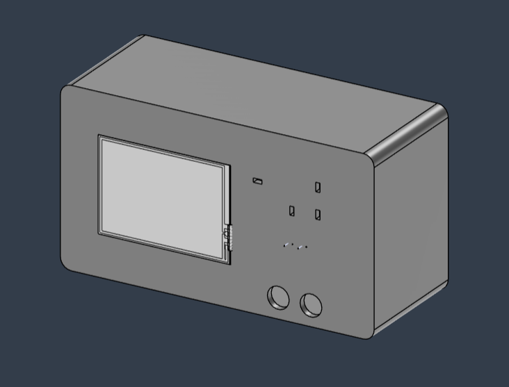
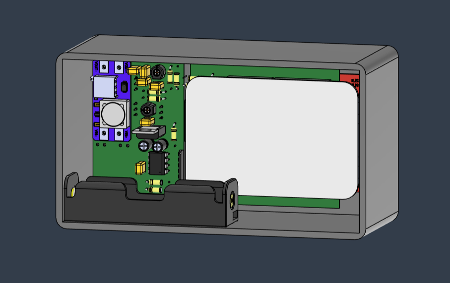

# Design do Case

O design do case foi desenvolvido com base nas dimensões da placa principal do projeto, garantindo o encaixe adequado dos componentes eletrônicos.  
Foram incluídas aberturas específicas para **switches**, **conectores de entrada** e uma **janela para o display**, permitindo fácil acesso e visualização durante o uso do dispositivo.

O modelo foi criado no **Autodesk Fusion 360**, utilizando medidas precisas obtidas do layout do PCB e dos componentes.  
O objetivo do design é fornecer proteção mecânica adequada, mantendo ao mesmo tempo a usabilidade e a estética do projeto.

---

## Visualizações do Case

### Vista Frontal

### Vista Traseira

---

## Considerações Finais

O design ainda pode passar por ajustes conforme o avanço da montagem e integração dos módulos, especialmente para otimizar a ventilação, o acesso a portas e a ergonomia geral do dispositivo.
