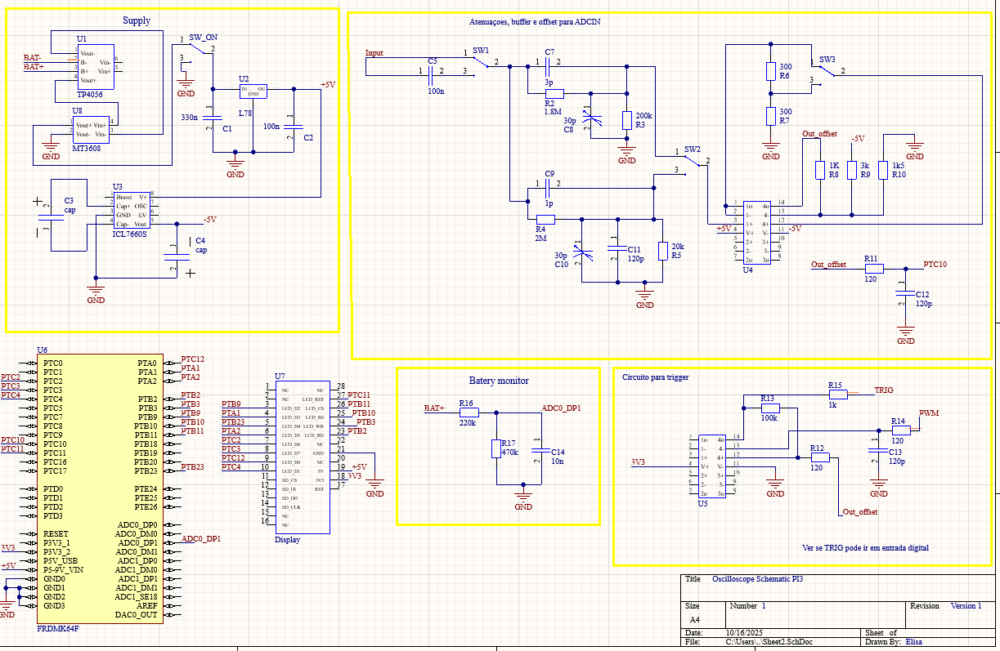

# Esquemático do Circuito do Osciloscópio Portátil

## 1. Bloco Supply
**Bateria e Módulos:**
U1 -> TP4056
Controla carga constante/corrente e protege contra sobrecarga.
Saída: ~4.2 V para alimentar ou carregar a célula Li-ion.

U8 -> MT3608
Eleva a tensão da bateria (3–4.2 V) para uma saída ajustável (ex: 7 V).
Útil pra alimentar L7805CDT-TR.

U2 -> L7805CDT-TR
Fornece 5 V estáveis a partir de uma entrada maior (MT3608).
Simples e limpo, mas dissipa calor em forma de perda.

U3 -> ICL7660S
Gera uma tensão de –V (–5 V) a partir de uma entrada positiva.
Usado pra alimentar amp-ops que precisam de alimentação simétrica.

## 2. Bloco Atenuações, Buffer e Offset para entrada analógica
**Filtros e amplificadores:**

Entrada com SW1 para AC ou DC. Seguido de atenuadores, com SW2 para escolha da atenuação. Segue para um Buffer (Seguidor de tensão), um SW3 para escolha de ganho e o circuito que adiciona o OFFSET.

## 3. Bloco para Monitorar Bateria
- **Divisor de tensão:** Simples divisor resistivo com saída máxima de 2.88V para monitorar tensão da bateria e sinalizar carregamento. Possui um capacitor de 10nF para filtragem de ruído.

## 4. Trigger
- **Fase de teste:** O circuito do Trigger ainda será testado, a ideia é tentar utilizar uma porta I/O para sua implementação.

## Esquemático 

