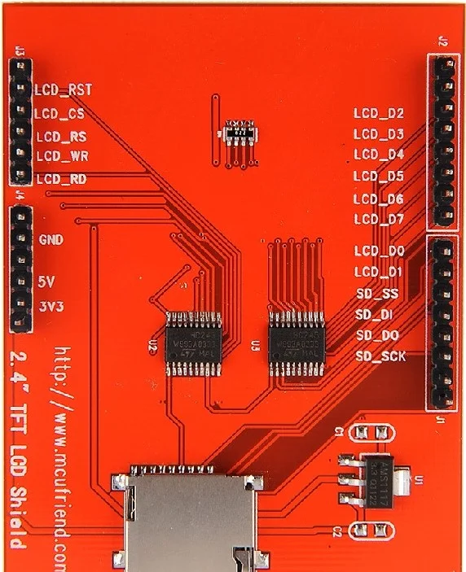
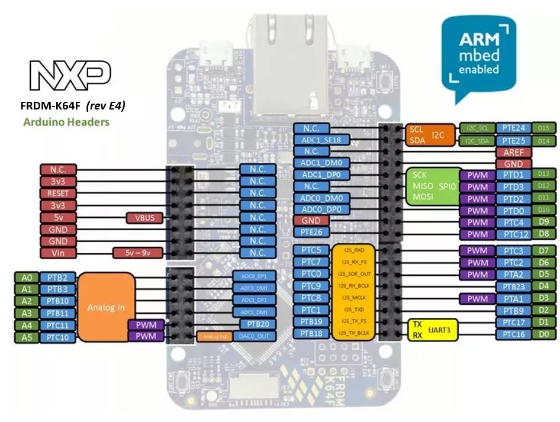

## Passo a Passo de Montagem — Bloco Supply

### U1 - TP4056 (Carregador Li-ion)
**Função:** Carrega a célula Li-ion via USB.

**Conexões:**
- `IN+` → +5V (USB)
- `IN−` → GND
- `BAT+` → Polo positivo da bateria
- `BAT−` → Polo negativo da bateria
---

### U8 - MT3608 (Conversor Boost Step-Up)
**Função:** Eleva a tensão da bateria (3–4.2V) para 7V estáveis.

**Conexões:**
- `IN+` → `OUT+` do TP4056 (ou `BAT+`)
- `IN−` → GND
- `OUT+` → Barramento +7V_BOOST
- `OUT−` → GND

**Ajuste:**
- Energize com a bateria conectada e regule o trimpot até obter **7.00V** na saída.  

### 🔧 U2 - L7805CDT-TR (Regulador Linear 5V)
**Função:** Gera 5V a partir de uma fonte >7V.

**Conexões:**
- `IN` → Fonte (+7V)
- `GND` → GND
- `OUT` → +5V_LIN

### U3 - ICL7660S (Gerador de Tensão Negativa)
**Função:** Cria –V (ex: –5V) a partir do +5V.

**Conexões:**
- `V+` → +5V (do barramento)
- `GND` → GND
- `CAP+` ↔ `CAP−` → Capacitor 10µF
- `VOUT` (ou `V−`) → Saída negativa (–V)
- Capacitor 10µF entre `V−` e GND

**Resultado:** Aproximadamente –5V com baixa corrente.
---

### Etapas de Teste
1. Monte e teste o **TP4056** + bateria (3.7–4.2V OK).  
2. Ligue o **MT3608** e ajuste para **7.00V**.  
3. Teste o **7805** (opcional, com fonte 7V).  
4. Selecione qual 5V alimenta o sistema.  
5. Alimente o **ICL7660S** e confirme –V.  
6. Garanta que todos os GNDs estão em comum.

## Conexão do Display TFT ao FRDM-K64F (Interface MCC)

Abaixo estão os mapeamentos entre os pinos do **Display LCD** e os pinos correspondentes do **FRDM-K64F** usados na **PCB Sanduíche**.

| **Pino Display** | **Pino FRDM-K64F (MCU)** | **Função / Descrição** |
|------------------:|:--------------------------|:------------------------|
| `LCD_D0` | `PTC12` | Dado bit 0 |
| `LCD_D1` | `PTC4`  | Dado bit 1 |
| `LCD_D2` | `PTB9`  | Dado bit 2 |
| `LCD_D3` | `PTA1`  | Dado bit 3 |
| `LCD_D4` | `PTB23` | Dado bit 4 |
| `LCD_D5` | `PTA2`  | Dado bit 5 |
| `LCD_D6` | `PTC2`  | Dado bit 6 |
| `LCD_D7` | `PTC3`  | Dado bit 7 |
| `LCD_RST` | `PTC11` | Reset do display |
| `LCD_CS`  | `PTB11` | Chip Select |
| `LCD_RS`  | `PTB10` | Register Select (Data/Command) |
| `LCD_WR`  | `PTB3`  | Write strobe |
| `LCD_RD`  | `PTB2`  | Read strobe |

### Observações Importantes
- Todos os sinais de dados (`D0–D7`) e controle (`RST`, `CS`, `RS`, `WR`, `RD`) devem operar em **nível lógico de 3.3V** — compatível com o FRDM-K64F.  
- Conecte também:
  - `VCC` → +5V (alimentação do módulo LCD)  
  - `GND` → GND comum  
  - `LED` (backlight) → +5V (ou GPIO via resistor se quiser controlar brilho)
- Mantenha o **barramento paralelo** com trilhas curtas e bem roteadas.
- Esses pinos devem ser configurados no **MCC (MCUXpresso Config Tools)** como **GPIO de saída digital**.

### Integração no Sistema
Após configurado:
- A **PCB Sanduíche** interliga estes pinos entre o **Display TFT** e o **FRDM-K64F**.
- O **MCC** gera a inicialização dos pinos automaticamente.  
- O display é então controlado pelo firmware via GPIO paralelos (modo 8 bits).

