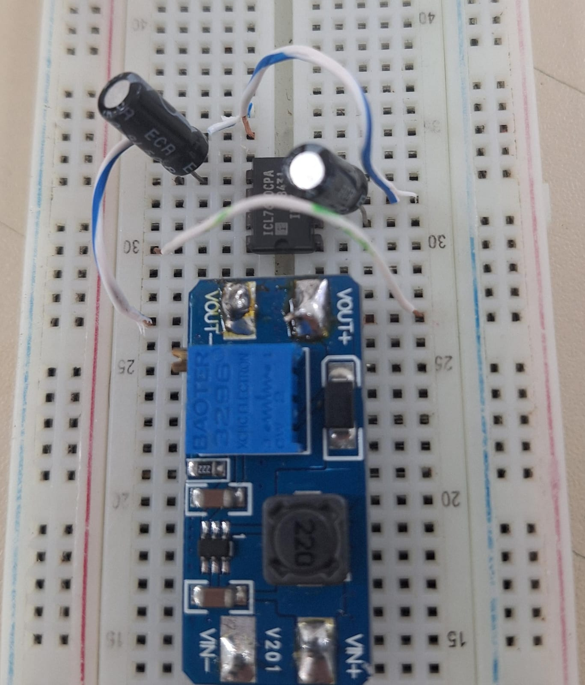

# Relatório de testes em Hardware

## Teste

Circuito de carregamento da bateria foi testado com o microcontrolador e a bateria, foi capaz de acender o Led do microcontrolador porém fraco.

O Display foi testado no microcontrolador, adapatando as bibliotecas e utilizando o software da NXP, MCUxpresso.

O circuito de elevação e geração de tensão simétrica foi testado, permitindo uma alimentação adequada.

