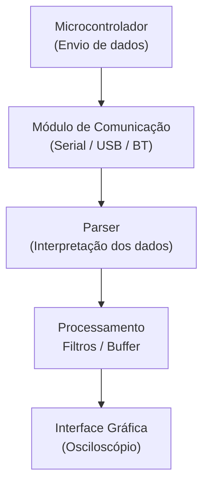

# Diagrama de Arquitetura de Software

A arquitetura do aplicativo foi projetada para ser modular, robusta e facilmente expansível.  
O fluxo segue o caminho:

**Microcontrolador → Comunicação → Parser → Módulo de Processamento → Interface Gráfica**

## Visão Geral da Arquitetura

## Descrição dos Módulos

### **1. Comunicação**
Responsável por estabelecer e manter a conexão com o microcontrolador, garantindo o recebimento contínuo dos dados.

### **2. Parser**
Interpreta cada pacote recebido, valida integridade e converte valores brutos para amostras utilizáveis.

### **3. Processamento**
Aplica filtros, organiza o buffer e gerencia triggers ou condições especiais.

### **4. Interface Gráfica**
Atualiza a forma de onda, controla zoom, escala e comandos do usuário.

## Objetivo da Arquitetura

- Separação clara entre camadas.
- Minimizar dependências diretas.
- Facilitar manutenção e testes.
