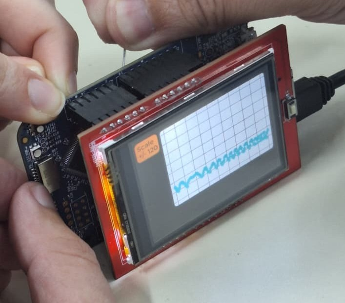
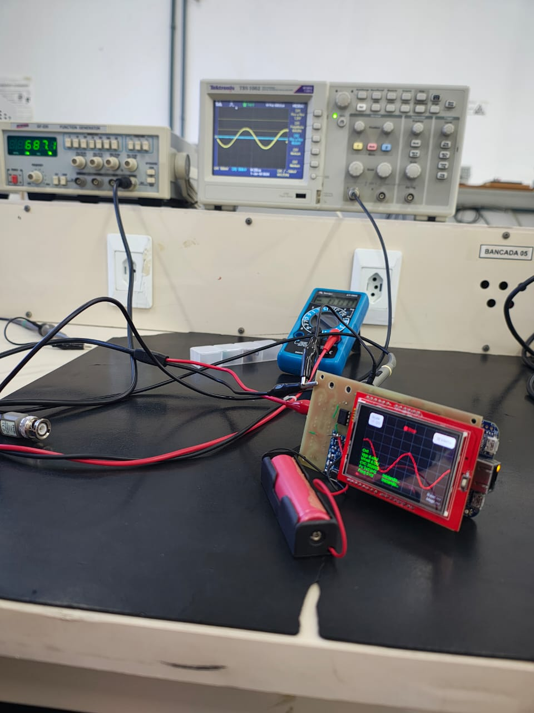
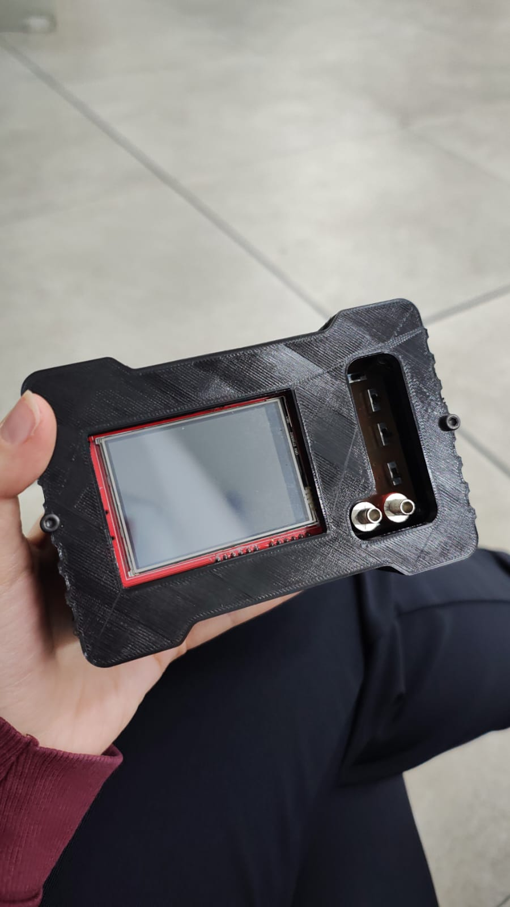

# Relatório de Integração

Este relatório descreve as etapas de integração entre o aplicativo, o firmware e o hardware do osciloscópio embarcado.

---

## 1. Integração Inicial

A primeira etapa consistiu em testar a comunicação usando dados sintéticos, enviados pelo microcontrolador apenas para validar o fluxo:

- Teste de conexão
- Teste de pacotes simples
- Teste de buffer circular

Isso permitiu validar que o app estava interpretando corretamente a estrutura dos pacotes.

---

## 2. Integração com o Firmware Real

Após os testes iniciais, o firmware passou a enviar amostras reais capturadas pelo ADC do microcontrolador.

Testes executados:

- Taxa de amostragem vs. taxa de transmissão
- Estabilidade da comunicação
- Sincronização entre pacotes
- Verificação de perda de dados

Ajustes realizados:

- Padronização do tamanho do pacote
- Correção de latência no app
- Mecanismo de recuperação de pacotes perdidos

---

## 3. Integração com Hardware Completo

Nesta fase, o hardware já incluía:

- Conversão de sinal
- Alimentação
- Case prototipado (primeira versão)

 

Validações feitas:

- Acesso aos conectores
- Estabilidade sob uso contínuo
- Testes de ruído e interferência elétrica
- Temperatura interna do case

 

---

## 4. Conclusão

A integração demonstrou que o fluxo completo funciona:

**Sinal → Microcontrolador → App → Osciloscópio Visual**

A partir daqui, ajustes finos e aprimoramentos podem ser realizados conforme novos testes forem executados.
