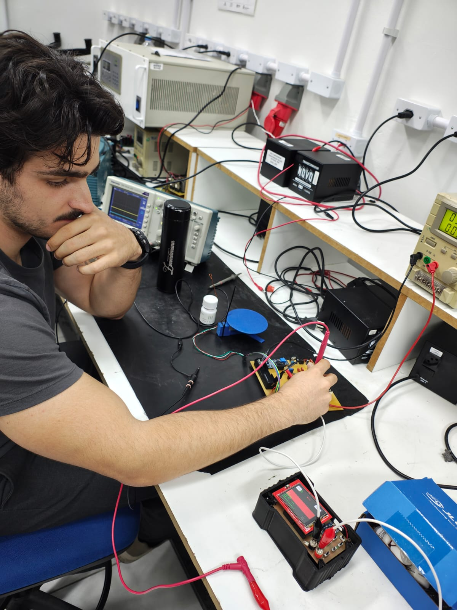

# Relatório Final de Testes e Validação

## Correção de bugs nos cálculos de Vpp, Vmed, Vrms e Frequência

Durante a etapa final de testes do projeto, foram identificados e corrigidos bugs relacionados aos cálculos de **amplitude pico a pico (Vpp)**, **valor médio (Vmed)**, **valor eficaz (Vrms)** e **frequência do sinal**. As correções envolveram principalmente o alinhamento correto do buffer de dados do DMA, e o ganho do circuito analógico.

Após as correções, os cálculos passaram a ser realizados **exclusivamente sobre o sinal corrigido**, garantindo coerência entre os valores exibidos e o sinal real medido na entrada analógica.

## Metodologia de Cálculo dos Parâmetros

### Aquisição e correção do sinal

Cada amostra do ADC é inicialmente lida no formato bruto (10 bits, intervalo de 0 a 1023).
Em seguida, é removido o offset físico do hardware, correspondente ao nível DC de aproximadamente 1,28 V, determinado experimentalmente. O sinal corrigido (raw_corr) passa a representar o sinal AC centrado em torno de zero e é utilizado como base para todos os cálculos estatísticos.
```c
int32_t raw_adc = aligned_buffer[i] & 0x3FF;
int32_t raw_corr = raw_adc - 385;
```
## Cálculo de Vpp (pico a pico)

Durante o processamento do buffer de amostras, são rastreados os valores mínimo e máximo do sinal corrigido:
```c
if (raw_corr < min_val) min_val = raw_corr;
if (raw_corr > max_val) max_val = raw_corr;
```
O valor pico a pico, em contagens do ADC, é obtido por:
```c
vpp_adc = max_val - min_val;
```
Esse valor é convertido para volts considerando a resolução do ADC, a tensão de referência e o ganho total do sistema:
```c
v_pp = (vpp_adc / ADC_MAX_COUNTS) * V_REF * g_total_gain;
```
## Cálculo do valor médio (Vmed)

O valor médio é calculado a partir da soma das amostras corrigidas:
```c
sum += raw_corr;
```
Ao final do buffer:
```c
vmed_adc = sum / DMA_BUFFER_SIZE;
v_med = (vmed_adc / ADC_MAX_COUNTS) * V_REF * g_total_gain;
```
Esse valor representa o nível DC médio do sinal de entrada.

## Cálculo do valor eficaz (Vrms)

O valor eficaz é calculado a partir da média do quadrado das amostras:
```c
sum_of_squares += (uint64_t)raw_corr * raw_corr;
```
Ao final do processamento:
```c
mean_square = sum_of_squares / DMA_BUFFER_SIZE;
vrms_adc = sqrt(mean_square);
v_rms = (vrms_adc / ADC_MAX_COUNTS) * V_REF * g_total_gain;
```
Esse método garante um cálculo correto do valor eficaz mesmo para sinais não puramente senoidais.

## Separação entre processamento e interface gráfica

Após os cálculos físicos, o sinal passa por um ajuste adicional exclusivamente para fins de visualização, aplicando o offset vertical configurado na interface gráfica:
```c
centered = raw_corr - g_vertical_offset;
```
Esse ajuste não interfere nos cálculos elétricos, sendo utilizado apenas para o mapeamento do sinal no display.

## Cálculo da Frequência do Sinal

A frequência do sinal é determinada por meio da detecção de cruzamentos por zero (zero-crossing), utilizando o buffer local de amostras.

O algoritmo identifica dois cruzamentos consecutivos do sinal de negativo para positivo:
```c
if (anterior < 0 && atual >= 0) {
    if (first_edge < 0) first_edge = i;
    else { second_edge = i; break; }
}
```
O período do sinal, em número de amostras, é então calculado como:
```c
period_samples = second_edge - first_edge;

freq_sinal_hz = fs_hz / period_samples;
```
Caso nenhum cruzamento válido seja encontrado, o sistema retorna um valor de debug indicando falha na detecção da frequência.

## Metodologia de Testes e Validação

Os testes experimentais foram realizados utilizando:

 - Gerador de funções para aplicação de sinais senoidais, triangulares e quadrados

 - Osciloscópio de bancada como referência de medição

 - A validação consistiu na comparação direta entre:

      - Forma de onda exibida no sistema embarcado

      - Valores calculados de Vpp, Vmed, Vrms e frequência

      - Valores medidos no osciloscópio

Os testes confirmaram o funcionamento correto do sistema para frequências de até 100 kHz, com boa concordância entre os valores medidos e os valores de referência.

## Conclusão

Após as correções implementadas, o sistema apresentou medições estáveis, coerentes e confiáveis, tanto em amplitude quanto em frequência. A separação clara entre correções físicas do sinal e ajustes gráficos foi fundamental para eliminar inconsistências observadas anteriormente, resultando em um osciloscópio embarcado funcional e validado experimentalmente.


# Validação com externos

O colega estava visualizando sua onda PWM com alto Duty Cycle.




